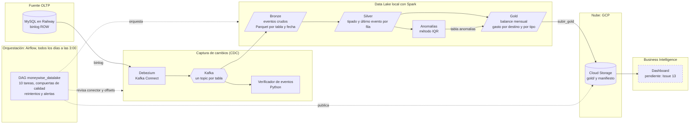

# MoneyWise-DataLake

[](https://github.com/dodamivid/MoneyWise-DataLake/actions/workflows/tests.yml)

Data lake financiero con **CDC (Change Data Capture) en tiempo real**. Captura cada
`INSERT` / `UPDATE` / `DELETE` de una base OLTP (MySQL) mediante Debezium, los transporta
por Kafka y los procesa con Spark Structured Streaming en un modelo por capas
**Bronze → Silver → Gold** (Parquet local). Sobre las capas curadas corre un módulo de
**detección de anomalías**, todo orquestado con **Airflow**, y la capa Gold se publica en
**GCP Cloud Storage** para alimentar un **dashboard de BI**.

> Fuente de datos: schema de dominio financiero (usuarios, ingresos, egresos, metas)
> adaptado de *MoneyWise-Integracion*.

---

## Arquitectura



### Flujo resumido

| Etapa | Tecnología | Qué hace |
|-------|-----------|----------|
| Fuente OLTP | MySQL en Railway (binlog ROW) | Base transaccional de MoneyWise; emite el binlog para el CDC. En Docker hay además una copia local de pruebas |
| CDC | Debezium sobre Kafka Connect | Lee el binlog y publica un evento por cada INSERT, UPDATE y DELETE. Excluye `auth_tokens` y `usuarios.password_hash` |
| Transporte | Kafka + Zookeeper | Un topic por tabla; buffer y desacople |
| Bronze | Spark Structured Streaming | Guarda cada mensaje tal cual llegó, en Parquet por tabla y fecha; cada corrida procesa lo nuevo y termina |
| Silver | Spark | Tablas limpias: último evento de cada fila (por offset de Kafka), sin DELETE, tipos explícitos |
| Gold | Spark | Balance mensual y gasto por destino y por tipo de pago, con las mismas reglas que la app |
| Anomalías | Spark | Gastos inusualmente altos por usuario y destino (IQR: atípico y extremo) |
| Orquestación | Airflow | DAG diario con compuertas de calidad, reintentos y alertas |
| Salida cloud | GCP Cloud Storage | `gold/<tabla>/data.parquet` y un manifiesto, con una service account de mínimo privilegio |
| BI | Power BI / Metabase | Dashboard sobre Gold (Issue 13, pendiente) |

> **Más detalle:** [docs/arquitectura.md](docs/arquitectura.md) explica el flujo de un cambio de punta a punta, las decisiones de diseño y por qué, la seguridad y los problemas que aparecieron.

---

## Estructura del repositorio

```
monelake/
├── docker-compose.yml        # Zookeeper, Kafka, Connect (Debezium), MySQL local, Spark y Airflow (con Postgres)
├── .env.example              # Plantilla de variables de entorno (cópiala a .env)
├── requirements-dev.txt      # dependencias de los tests (pytest, pyarrow, PyMySQL)
├── .github/workflows/        # CI: corre los tests en cada PR                           [Issue 12]
├── connectors/               # mysql-source.json — conector Debezium                    [Issue 3]
├── mysql/init/               # MySQL local de pruebas: schema y usuario debezium        [Issue 2]
├── kafka/scripts/            # consumer de verificación de eventos                      [Issue 4]
├── spark/
│   ├── jobs/bronze/          # ingesta cruda Kafka → Parquet                            [Issue 5]
│   ├── jobs/silver/          # limpieza y último evento por fila                        [Issue 6]
│   ├── jobs/gold/            # agregaciones de negocio                                  [Issue 7]
│   └── common/               # schemas por tabla
├── anomalies/                # detección de anomalías (IQR) y su verificador            [Issue 8]
├── airflow/                  # Dockerfile y DAG moneywise_datalake                      [Issue 9]
├── gcp/                      # subir_gold.py: Gold → Cloud Storage                      [Issue 10]
├── data/{bronze,silver,gold}/  # salida Parquet local (no versionada)
├── tests/                    # pytest: calidad de Gold, defectos inyectados y cuadre con Railway [Issue 12]
├── dashboard/                # conexión y capturas del dashboard de BI                  [Issue 13]
├── docs/                     # arquitectura, decisiones y problemas resueltos           [Issue 11]
└── scripts/                  # create_issues.sh (crea las 13 issues) y generar_secretos.py (secretos de Airflow)
```

---

## Estado de las issues

Leyenda: ⚪ Pendiente · 🟡 En progreso · 🟢 Completo

| #  | Issue | Estado | Parte de la arquitectura |
|----|-------|--------|--------------------------|
| [1](https://github.com/dodamivid/MoneyWise-DataLake/issues/1)  | Setup del repo y docker-compose base |  🟢 Completo | Infraestructura — MySQL, Zookeeper, Kafka, Kafka Connect (Debezium) |
| [2](https://github.com/dodamivid/MoneyWise-DataLake/issues/2)  | Fuente MySQL con datos reales | 🟢 Completo | Fuente OLTP — MySQL + binlog |
| [3](https://github.com/dodamivid/MoneyWise-DataLake/issues/3)  | Conector CDC con Debezium | 🟢 Completo | CDC — Debezium → Kafka (topics por tabla) |
| [4](https://github.com/dodamivid/MoneyWise-DataLake/issues/4)  | Script de verificación de eventos | 🟢 Completo | CDC — consumer de validación de Kafka |
| [5](https://github.com/dodamivid/MoneyWise-DataLake/issues/5)  | Spark Job: Bronze (ingesta cruda) | 🟢 Completo | Data Lake — capa Bronze |
| [6](https://github.com/dodamivid/MoneyWise-DataLake/issues/6)  | Spark Job: Silver (limpieza y estandarización) | 🟢 Completo  | Data Lake — capa Silver |
| [7](https://github.com/dodamivid/MoneyWise-DataLake/issues/7)  | Spark Job: Gold (capa curada para BI) | 🟢 Completo | Data Lake — capa Gold |
| [8](https://github.com/dodamivid/MoneyWise-DataLake/issues/8)  | Detección de anomalías | 🟢 Completo | Data Lake — anomalías sobre Silver/Gold |
| [9](https://github.com/dodamivid/MoneyWise-DataLake/issues/9)  | Orquestación con Airflow | 🟢 Completo | Orquestación — DAG Bronze→Silver→Gold→anomalías |
| [10](https://github.com/dodamivid/MoneyWise-DataLake/issues/10) | Salida a Cloud (GCP) | 🟢 Completo | Nube — GCP Cloud Storage (capa Gold) |
| [11](https://github.com/dodamivid/MoneyWise-DataLake/issues/11) | Documentación y diagrama de arquitectura | 🟢 Completo | Transversal — documentación |
| [12](https://github.com/dodamivid/MoneyWise-DataLake/issues/12) | Tests de calidad de datos | 🟢 Completo | Transversal — QA sobre capa Gold |
| [13](https://github.com/dodamivid/MoneyWise-DataLake/issues/13) | Dashboard de BI conectado a Gold | ⚪ Pendiente | Business Intelligence (depende del Issue 7) |

> **Reglas de Gold:** solo movimientos activos (`eliminado_en` vacío); cada movimiento cuenta una vez, sin repartir los recurrentes por frecuencia; el mes sale de `fecha_inicio`; sin datos personales (solo `usuario_id`). Son las mismas reglas que usan los `sp_dashboard_*` de la app.

> **Tablas de Gold:** `balance_mensual`; `gasto_por_destino_mensual` (la categoría del gasto: Renta, Alimentación, Transporte...) y `gasto_por_tipo_mensual` (el método de pago: Efectivo, Tarjeta, Transferencia...). Un egreso sin destino aparece como "Sin destino".

---

## Cómo correr todo local

### Requisitos

- **Docker Desktop** con unos **8 GB de RAM** asignados (Airflow pide al menos 4 GB y aquí corren además Kafka y Spark).
- **Python 3.10+** en tu equipo, para el verificador de eventos (`kafka/scripts/verify_events.py`) y los tests de calidad. Spark corre dentro de Docker: no necesitas Java.
- Una base **MySQL en Railway** con el binlog activado y un usuario para Debezium (ver abajo).
- *(Opcional)* una cuenta de **GCP con facturación** para publicar Gold en Cloud Storage. Sin ella, el pipeline corre igual y la tarea `subir_gold` se omite.

### Preparación (una sola vez)

**1. La fuente en Railway.** El servicio MySQL debe emitir el binlog: si su comando de inicio trae `--disable-log-bin`, quítalo. Crea un usuario de solo lectura y replicación para Debezium:

```sql
CREATE USER 'debezium'@'%' IDENTIFIED BY '<una-contraseña-fuerte>';
GRANT SELECT, RELOAD, SHOW DATABASES, REPLICATION SLAVE, REPLICATION CLIENT ON *.* TO 'debezium'@'%';
```

**2. Tu `.env` y los secretos de Airflow.** Este script crea el `.env` desde la plantilla si no existe y **genera los 4 secretos de Airflow sin mostrarlos**. Solo llena los que están vacíos, así que puedes correrlo cuantas veces quieras sin cambiar contraseñas existentes:

```bash
python scripts/generar_secretos.py
```

Después abre el `.env` y completa a mano `RAILWAY_MYSQL_HOST`, `RAILWAY_MYSQL_PORT` y `RAILWAY_MYSQL_PASSWORD`.

**3. *(Opcional)* Cloud Storage.** Sigue [la guía de docs/arquitectura.md](docs/arquitectura.md#configurar-cloud-storage-una-sola-vez-opcional) y completa `GCP_PROJECT_ID` y `GCS_BUCKET` en el `.env`.

### Pasos

```bash
# 1. Infraestructura (Issue 1)
docker compose up -d

# 2. Cargar el conector Debezium (Issue 3)
curl -X POST -H "Content-Type: application/json" \
  --data @connectors/mysql-source.json \
  http://localhost:8083/connectors

# 3. Verificar eventos CDC (Issue 4)
python kafka/scripts/verify_events.py

# 4. Pipeline a mano: Spark y anomalías (Issues 5-8)
docker exec mw-spark /usr/local/spark/bin/spark-submit --packages org.apache.spark:spark-sql-kafka-0-10_2.13:4.2.0 --conf spark.jars.ivy=/tmp/ivy /home/jovyan/work/spark/jobs/bronze/bronze_job.py
docker exec mw-spark /usr/local/spark/bin/spark-submit /home/jovyan/work/spark/jobs/silver/silver_job.py
docker exec mw-spark /usr/local/spark/bin/spark-submit /home/jovyan/work/spark/jobs/gold/gold_job.py
docker exec mw-spark /usr/local/spark/bin/spark-submit /home/jovyan/work/anomalies/anomalias_job.py

# 5. Orquestación completa (Issue 9): Airflow corre lo anterior solo
#    Interfaz: http://localhost:8085   usuario: admin   contraseña: AIRFLOW_ADMIN_PASSWORD de tu .env
#    DAG: moneywise_datalake (nace en pausa: actívalo con su interruptor)

# 6. Publicar Gold en Cloud Storage (Issue 10): lo hace el DAG al final; a mano:
docker exec mw-airflow-scheduler python /opt/airflow/gcp/subir_gold.py --dry-run   # solo muestra qué subiría
docker exec mw-airflow-scheduler python /opt/airflow/gcp/subir_gold.py             # sube y verifica

# 7. Tests de calidad (Issue 12): leen los Parquet de data/, así que corren después del paso 4 o 5
pip install -r requirements-dev.txt
pytest                      # contrato, nulos, llaves, coherencia y recálculo desde Silver
pytest -m fuente            # además, cuadra el lago contra la base real en Railway (solo lectura)
pytest --datos=sintetico    # sin datos reales: lo mismo que corre el CI
```

> **Apagar y prender:** usa `docker compose down` (sin `-v`) y `docker compose up -d`. Zookeeper, Kafka y MySQL tienen volúmenes, así que sus datos sobreviven. `down -v` lo borra todo. Si recreas el volumen de Kafka, vacía `data/bronze` y `data/checkpoints` y reconstruye Bronze, Silver y Gold: los offsets de Bronze pertenecen al topic anterior.

> **Puertos:** todos los puertos publicados escuchan solo en `127.0.0.1`: Kafka 9092, Kafka Connect 8083, Zookeeper 2181, MySQL local 3307, Jupyter 8888, interfaz de Spark 4040 y Airflow 8085.

> **Anomalías:** método IQR sobre egresos activos, por usuario y destino. "Atípico" supera Q3 + 1.5 × IQR y "extremo" supera Q3 + 3 × IQR; solo se marcan montos altos. Los grupos con menos de 8 movimientos o IQR = 0 no se evalúan. La tabla `data/gold/anomalias` no lleva la descripción del gasto. Los umbrales se cambian al ejecutar el job, con `docker exec -e ANOM_K_ATIPICO=1.0 mw-spark ...`; las variables `ANOM_MIN_MOVIMIENTOS`, `ANOM_K_ATIPICO` y `ANOM_K_EXTREMO` se leen dentro del contenedor de Spark, así que ponerlas en `.env` no tiene efecto.

> **Airflow:** el DAG `moneywise_datalake` corre todos los días a las 3:00 (hora de Chihuahua) y encadena `revisar_infra → hay_datos_nuevos → bronze → silver → check_silver → gold → check_gold → anomalías → check_anomalías → subir_gold`. Si Kafka no tiene datos nuevos desde la última corrida de Bronze, se salta el resto (con el parámetro `forzar` corre igual). Los `check_*` son compuertas de calidad: si un chequeo falla, el DAG se detiene y no se publica nada. Cada tarea se reintenta 2 veces; los reintentos y las fallas se anotan en `airflow/logs/alertas.log`. Las tareas ejecutan `docker exec mw-spark ...`, por eso solo el scheduler tiene montado el socket de Docker.

> **Tests de calidad:** `tests/` es una suite de pytest que corre fuera de Airflow, sin Spark ni Docker. Verifica el contrato de las tablas de Gold (columnas y tipos), los nulos en campos clave, las llaves repetidas, la coherencia entre tablas y un recálculo completo de Gold y de las anomalías desde Silver en Python puro. También prueba a sus propios chequeos: inyecta defectos a un lago sano y exige que cada uno sea detectado. `pytest -m fuente` cuadra el lago contra Railway (filas por tabla y totales por usuario y mes) usando solo `SELECT`; compara contra la base en vivo, así que úsalo justo después de correr el pipeline. En cada PR, GitHub Actions corre la suite sobre un lago sintético en Python 3.10, 3.12 y 3.14. Para apuntar a otra carpeta de datos usa `--datos-dir=RUTA` (con el signo `=`).

> **Cloud Storage:** al final del DAG, `subir_gold` publica las 4 tablas de Gold en `gs://<tu-bucket>/gold/<tabla>/data.parquet` con nombre fijo (cada corrida sobrescribe la anterior), verifica tamaño y MD5 y publica `gold/_manifest.json`. Se autentica con una service account: la llave JSON vive en `gcp/credentials/` (ignorada por git) y solo el scheduler la tiene montada. Si `GCS_BUCKET` está vacío la tarea se omite y el resto del pipeline sigue igual. Para entrar al free tier el bucket debe estar en `us-central1`, `us-east1` o `us-west1`.