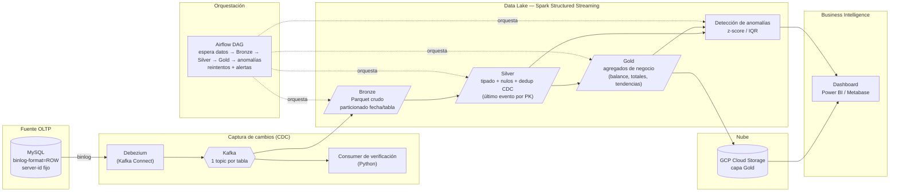

# MoneyWise-DataLake

Data lake financiero con **CDC (Change Data Capture) en tiempo real**. Captura cada
`INSERT` / `UPDATE` / `DELETE` de una base OLTP (MySQL) mediante Debezium, los transporta
por Kafka y los procesa con Spark Structured Streaming en un modelo por capas
**Bronze → Silver → Gold** (Parquet local). Sobre las capas curadas corre un módulo de
**detección de anomalías**, todo orquestado con **Airflow**, y la capa Gold se publica en
**GCP Cloud Storage** para alimentar un **dashboard de BI**.

> Fuente de datos: schema de dominio financiero (usuarios, ingresos, egresos, metas)
> adaptado de *MoneyWise-Integracion*.

---

## Arquitectura



### Flujo resumido

| Etapa | Tecnología | Qué hace |
|-------|-----------|----------|
| Fuente OLTP | MySQL (binlog ROW) | Base transaccional de MoneyWise; emite binlog para CDC |
| CDC | Debezium sobre Kafka Connect | Lee el binlog y publica eventos de cambio |
| Transporte | Kafka + Zookeeper | Un topic por tabla, buffer y desacople |
| Bronze | Spark Structured Streaming | Ingesta cruda de los topics a Parquet, sin transformar |
| Silver | Spark | Limpieza, tipado, manejo de nulos, dedup por PK con el evento CDC más reciente |
| Gold | Spark | Agregaciones de negocio para BI (balance, totales por usuario/mes, tendencias por categoría) |
| Anomalías | Spark / Python | Detección estadística (z-score o IQR) de transacciones atípicas |
| Orquestación | Airflow | DAG que encadena las capas con reintentos y alertas |
| Salida cloud | GCP Cloud Storage | Publica la capa Gold en un bucket (free tier) vía service account |
| BI | Power BI / Metabase | Dashboard sobre Gold: balance, gasto por categoría, anomalías |

---

## Estructura del repositorio

```
monelake/
├── docker-compose.yml        # MySQL + Zookeeper + Kafka + Kafka Connect (Debezium)   [Issue 1]
├── .env.example              # Plantilla de variables de entorno
├── connectors/               # mysql-source.json — conector Debezium                    [Issue 3]
├── mysql/init/               # schema + seed de datos de prueba                         [Issue 2]
├── kafka/scripts/            # consumer de verificación de eventos                      [Issue 4]
├── spark/
│   ├── jobs/bronze/          # ingesta cruda Kafka → Parquet                           [Issue 5]
│   ├── jobs/silver/          # limpieza + dedup CDC                                     [Issue 6]
│   ├── jobs/gold/            # agregaciones de negocio                                  [Issue 7]
│   └── common/               # utilidades compartidas (sesión Spark, schemas)
├── anomalies/                # detección estadística de anomalías                      [Issue 8]
├── airflow/dags/             # DAG de orquestación                                     [Issue 9]
├── gcp/                      # subida de Gold a Cloud Storage                          [Issue 10]
├── data/{bronze,silver,gold}/  # salida Parquet local (no versionada)
├── tests/                    # data quality checks (pytest / great_expectations)      [Issue 12]
├── dashboard/                # conexión y capturas del dashboard de BI                 [Issue 13]
├── docs/                     # documentación y diagramas                              [Issue 11]
└── scripts/create_issues.sh  # crea las 13 issues en GitHub con gh
```

---

## Estado de las issues

Leyenda: ⚪ Pendiente · 🟡 En progreso · 🟢 Completo

| #  | Issue | Estado | Parte de la arquitectura |
|----|-------|--------|--------------------------|
| [1](https://github.com/dodamivid/MoneyWise-DataLake/issues/1)  | Setup del repo y docker-compose base |  🟢 Completo | Infraestructura — MySQL, Zookeeper, Kafka, Kafka Connect (Debezium) |
| [2](https://github.com/dodamivid/MoneyWise-DataLake/issues/2)  | Fuente MySQL con datos reales | 🟢 Completo | Fuente OLTP — MySQL + binlog |
| [3](https://github.com/dodamivid/MoneyWise-DataLake/issues/3)  | Conector CDC con Debezium | 🟢 Completo | CDC — Debezium → Kafka (topics por tabla) |
| [4](https://github.com/dodamivid/MoneyWise-DataLake/issues/4)  | Script de verificación de eventos | 🟢 Completo | CDC — consumer de validación de Kafka |
| [5](https://github.com/dodamivid/MoneyWise-DataLake/issues/5)  | Spark Job: Bronze (ingesta cruda) | ⚪ Pendiente | Data Lake — capa Bronze |
| [6](https://github.com/dodamivid/MoneyWise-DataLake/issues/6)  | Spark Job: Silver (limpieza y estandarización) | ⚪ Pendiente | Data Lake — capa Silver |
| [7](https://github.com/dodamivid/MoneyWise-DataLake/issues/7)  | Spark Job: Gold (capa curada para BI) | ⚪ Pendiente | Data Lake — capa Gold |
| [8](https://github.com/dodamivid/MoneyWise-DataLake/issues/8)  | Detección de anomalías | ⚪ Pendiente | Data Lake — anomalías sobre Silver/Gold |
| [9](https://github.com/dodamivid/MoneyWise-DataLake/issues/9)  | Orquestación con Airflow | ⚪ Pendiente | Orquestación — DAG Bronze→Silver→Gold→anomalías |
| [10](https://github.com/dodamivid/MoneyWise-DataLake/issues/10) | Salida a Cloud (GCP) | ⚪ Pendiente | Nube — GCP Cloud Storage (capa Gold) |
| [11](https://github.com/dodamivid/MoneyWise-DataLake/issues/11) | Documentación y diagrama de arquitectura | ⚪ Pendiente | Transversal — documentación |
| [12](https://github.com/dodamivid/MoneyWise-DataLake/issues/12) | Tests de calidad de datos | ⚪ Pendiente | Transversal — QA sobre capa Gold |
| [13](https://github.com/dodamivid/MoneyWise-DataLake/issues/13) | Dashboard de BI conectado a Gold | ⚪ Pendiente | Business Intelligence (depende del Issue 7) |

---

## Cómo correr todo local

> Se irá completando conforme avancen las issues.

```bash
# 1. Infraestructura (Issue 1)
cp .env.example .env
docker-compose up -d

# 2. Cargar el conector Debezium (Issue 3)
curl -X POST -H "Content-Type: application/json" \
  --data @connectors/mysql-source.json \
  http://localhost:8083/connectors

# 3. Verificar eventos CDC (Issue 4)
python kafka/scripts/verify_events.py

# 4. Pipeline Spark (Issues 5-7)
docker exec mw-spark /usr/local/spark/bin/spark-submit --packages org.apache.spark:spark-sql-kafka-0-10_2.13:4.2.0 --conf spark.jars.ivy=/tmp/ivy /home/jovyan/work/spark/jobs/bronze/bronze_job.py
python spark/jobs/silver/silver_job.py
python spark/jobs/gold/gold_job.py

# 5. Orquestación completa (Issue 9)
# vía Airflow DAG: moneywise_datalake
```

---

## Requisitos

- Docker + Docker Compose
- Python 3.10+
- Java 11+ (para Spark)
- Cuenta GCP con free tier (para Issue 10)
