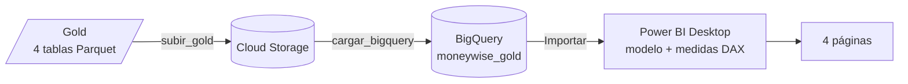
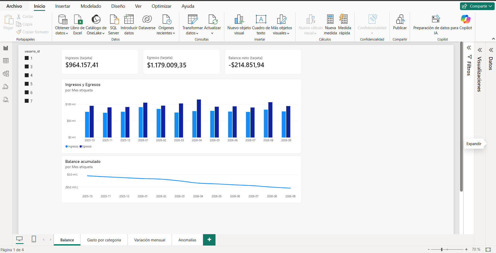
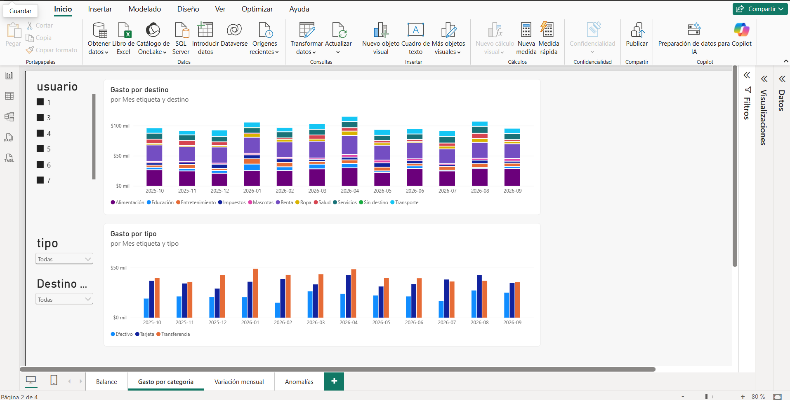
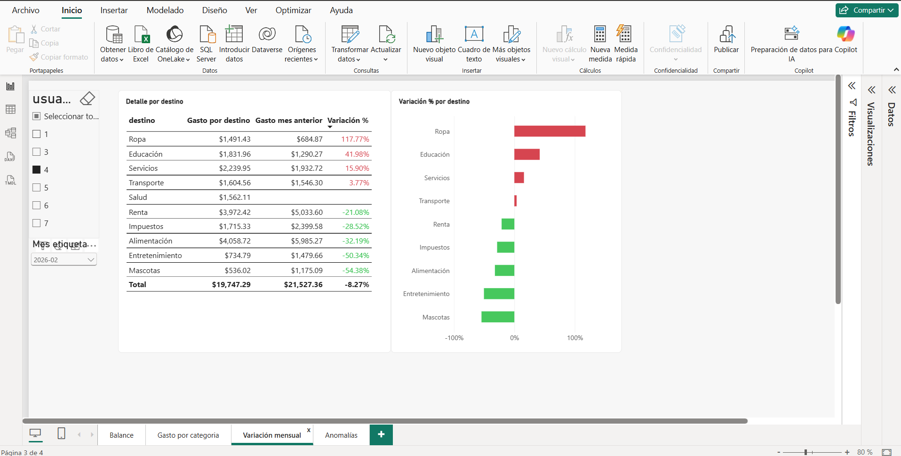
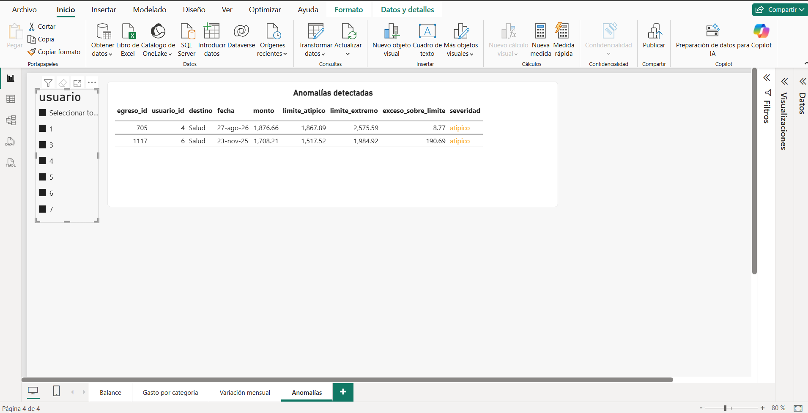

# Dashboard de BI (Power BI Desktop)

Dashboard de 4 páginas sobre las tablas de Gold que el DAG deja en BigQuery. Responde tres preguntas: **cuánto entra y sale por usuario y mes**, **en qué se gasta a lo largo del tiempo** y **qué gastos son anómalos**.

| Archivo | Qué es |
|---|---|
| [`moneywise-gold.pbix`](moneywise-gold.pbix) | El dashboard. Ábrelo con Power BI Desktop (solo Windows) |
| Este README | Cómo conectar, el modelo, las medidas y cómo se comprobaron las cifras |



## Las 4 páginas

### 1. Balance
Ingresos, egresos y balance neto por usuario y mes. Tres tarjetas arriba (ingresos, egresos y balance neto del usuario elegido), un gráfico de columnas con ingresos contra egresos mes a mes y una línea con el balance acumulado.



### 2. Gasto por categoría
Gasto por **destino** (la categoría: Renta, Alimentación...) apilado por mes, y gasto por **tipo** (el método de pago: Efectivo, Tarjeta, Transferencia) agrupado por mes. Además del selector de usuario hay un desplegable de destino (que filtra solo el gráfico de destino) y uno de tipo (que filtra solo el gráfico de tipo). Por qué no se filtran entre sí está en las [limitaciones](#limitaciones).



### 3. Variación mensual
Para un usuario y un mes, cuánto gastó en cada destino, cuánto había gastado el mes anterior y cuánto varió en porcentaje. La tabla va ordenada de mayor a menor variación y el color de la variación marca el sentido: **rojo si el gasto subió, verde si bajó**. El gráfico de barras muestra lo mismo de un vistazo.



### 4. Anomalías
Los gastos que la detección por IQR marcó como inusualmente altos, con su monto, los dos límites y cuánto se pasó del límite. La severidad va en **rojo si es "extremo"** y en **ámbar si es "atípico"**.



## Cómo conectar

Requisitos: Power BI Desktop y una cuenta de Google con permiso de lectura sobre el dataset `moneywise_gold` (*BigQuery Data Viewer*) y de ejecutar consultas en el proyecto (*BigQuery Job User*).

1. En Power BI Desktop: **Inicio** → **Obtener datos** → busca **Google BigQuery** → **Conectar**.
2. En **Opciones avanzadas** escribe el **ID del proyecto de facturación**: `moneywise-datalake`. Es el proyecto donde se ejecutan (y se facturan) las consultas de Power BI.
3. Elige **Importar**, no DirectQuery. Con Importar los datos se copian al archivo y el dashboard no consulta BigQuery en cada clic.
4. Inicia sesión con tu cuenta de Google.
5. En el navegador marca las 4 tablas de `moneywise-datalake` → `moneywise_gold`: `balance_mensual`, `gasto_por_destino_mensual`, `gasto_por_tipo_mensual` y `anomalias`. **Cargar**.
6. Crea las dos dimensiones, las relaciones y las medidas de las secciones siguientes.

Para abrir el `.pbix` ya hecho no hace falta repetir nada: se ve con los datos que trae. Para **actualizarlos** (**Inicio** → **Actualizar**) Power BI pedirá iniciar sesión con tu cuenta de Google, que necesita los permisos de arriba. El archivo no guarda credenciales.


## El modelo

Las cuatro tablas de Gold son tablas de **hechos**. Para que un selector de usuario o de mes filtre las cuatro a la vez, hacen falta dos tablas pequeñas de **dimensión** con un valor por fila. Se crean en **Modelado** → **Nueva tabla**:

```dax
dim_usuario = DISTINCT(balance_mensual[usuario_id])
dim_mes = DISTINCT(balance_mensual[mes])
```

Y en `dim_mes`, una columna de texto para mostrar los meses como `2026-02` y que se ordenen bien en los ejes:

```dax
Mes etiqueta = FORMAT(dim_mes[mes], "yyyy-MM")
```

### Relaciones

Las 7 son **muchos a uno** (`*:1`), con dirección de filtro **única**, de la dimensión hacia el hecho:

| Hecho | Columna | Dimensión |
|---|---|---|
| `balance_mensual` | `usuario_id` | `dim_usuario` |
| `gasto_por_destino_mensual` | `usuario_id` | `dim_usuario` |
| `gasto_por_tipo_mensual` | `usuario_id` | `dim_usuario` |
| `anomalias` | `usuario_id` | `dim_usuario` |
| `balance_mensual` | `mes` | `dim_mes` |
| `gasto_por_destino_mensual` | `mes` | `dim_mes` |
| `gasto_por_tipo_mensual` | `mes` | `dim_mes` |

`anomalias` no se relaciona con `dim_mes` porque no tiene la columna `mes`: trae `fecha`.

Al cargar las tablas, Power BI crea relaciones automáticas entre las tablas de hechos (uno a uno, y alguna en ambas direcciones). Hay que **borrarlas**: un filtro que se propaga entre hechos da cifras que no corresponden.


## Medidas DAX

Una medida es una fórmula que Power BI **recalcula cada vez que cambia un filtro**: el mismo `[Ingresos]` da un número en la tarjeta del usuario 3 y otro en la del usuario 4, sin escribir nada más.

| Medida | Fórmula | Para qué sirve |
|---|---|---|
| `Ingresos` | `SUM(balance_mensual[total_ingresos])` | Ingresos del usuario y meses filtrados |
| `Egresos` | `SUM(balance_mensual[total_egresos])` | Egresos del usuario y meses filtrados |
| `Balance neto` | `[Ingresos] - [Egresos]` | Lo que sobra o falta |
| `Balance acumulado` | `CALCULATE([Balance neto], FILTER(ALL(dim_mes[mes]), dim_mes[mes] <= MAX(dim_mes[mes])))` | Suma el balance de todos los meses hasta el mes de cada punto de la línea |
| `Ingresos (tarjeta)` | `FORMAT([Ingresos], "$#,##0.00")` | Texto para las tarjetas (ver nota) |
| `Egresos (tarjeta)` | `FORMAT([Egresos], "$#,##0.00")` | Ídem |
| `Balance neto (tarjeta)` | `FORMAT([Balance neto], "$#,##0.00;-$#,##0.00")` | Ídem, con el signo menos delante |
| `Gasto por destino` | `SUM(gasto_por_destino_mensual[total_egresos])` | Gasto por categoría |
| `Gasto por tipo` | `SUM(gasto_por_tipo_mensual[total_egresos])` | Gasto por método de pago |
| `Gasto mes anterior` | `SUM(gasto_por_destino_mensual[total_mes_anterior])` | Lo que se gastó en ese destino el mes anterior |
| `Variación %` | `DIVIDE([Gasto por destino] - [Gasto mes anterior], [Gasto mes anterior])` | Cambio porcentual contra el mes anterior |
| `Color severidad` | `SWITCH(SELECTEDVALUE(anomalias[severidad]), "extremo", "#C62828", "atípico", "#F9A825", "atipico", "#F9A825", "#000000")` | Devuelve el color con el que se pinta cada fila de anomalías |

**Notas de diseño**

- **Las tarjetas usan medidas de texto.** Una tarjeta abrevia las cifras grandes (`$1.18 mill.`) y su formato numérico no lo evita. `FORMAT` devuelve el monto exacto como texto. Se usan **solo en tarjetas**: un texto no se puede sumar ni graficar.
- **`Variación %` se recalcula, no se suma.** La columna `variacion_pct` de Gold ya es un porcentaje por fila (por ejemplo `-28.52`); sumarla o promediarla daría una cifra sin sentido en el total. Con la medida, el total es el cambio real del conjunto: (gasto − gasto anterior) / gasto anterior. Se le da formato de porcentaje con 2 decimales.
- **Decimales fijos.** `Gasto por destino` y `Gasto mes anterior` llevan 2 decimales fijados; sin eso, un redondeo de punto flotante puede mostrar `$5,503.219999999999`.
- **Tablas planas.** En las tablas de la página 4, los campos numéricos (`egreso_id`, `monto`, límites y exceso) se ponen en **No resumir** y `fecha` se elige como fecha simple, no como jerarquía; si no, Power BI los suma y parte la fecha en año, trimestre, mes y día.
- **Formato de cifras.** Power BI toma el separador de miles y de decimales de la configuración regional de Windows; con otra configuración, `1,179,009.35` se verá como `1.179.009,35`.

## Cómo se comprobaron las cifras

`pytest -m bigquery` ya cuadra BigQuery contra el lago (ver el [README principal](../README.md)). Eso no cubre a Power BI, así que el dashboard se comprobó a mano contra BigQuery con consultas SQL:

| Dónde | Filtro | Power BI muestra | Consulta de comprobación |
|---|---|---|---|
| Balance | usuario 3 | ingresos 173,493.66, egresos 240,651.65, balance neto −67,157.99 | `SELECT SUM(total_ingresos), SUM(total_egresos), SUM(balance) FROM moneywise_gold.balance_mensual WHERE usuario_id = 3` |
| Variación mensual | usuario 4, mes 2026-02, destino Impuestos | 1,715.33 · 2,399.58 · −28.52 % | la consulta de abajo |
| Anomalías | todos los usuarios | 2 filas: egreso 705 (usuario 4) y egreso 1117 (usuario 6), ambas Salud y "atípico" | `SELECT * FROM moneywise_gold.anomalias` |

```sql
SELECT total_egresos, total_mes_anterior, variacion_pct
FROM `moneywise-datalake.moneywise_gold.gasto_por_destino_mensual`
WHERE usuario_id = 4 AND destino = 'Impuestos' AND mes = DATE '2026-02-01';
```

En esa misma vista, el total (19,747.29 contra 21,527.36) da −8.27 %, que es lo que muestra la tabla. Para ver el estado del DAG que alimenta todo esto: [Airflow con las 11 tareas](../docs/images/airflow-dag-11-tareas.png).

## Limitaciones

- **El filtro de destino no filtra el gráfico de tipo, ni al revés.** `gasto_por_destino_mensual` no tiene la columna `tipo` y `gasto_por_tipo_mensual` no tiene `destino`: son agregaciones distintas, y desde un destino no se puede saber a qué método de pago corresponde su gasto. Para cruzarlos haría falta una tabla de Gold nueva, `gasto_por_destino_tipo_mensual`, con usuario, mes, destino y tipo. Queda anotada como mejora.
- **Un destino sin gasto el mes anterior no tiene variación.** El primer mes de cada destino aparece con `Gasto mes anterior` y `Variación %` vacíos; `DIVIDE` los deja en blanco en lugar de dar error.
- **Modo Importar: los datos no se actualizan solos.** El DAG renueva BigQuery todos los días, pero el `.pbix` conserva su copia hasta que alguien pulse **Actualizar**. La actualización programada requeriría publicar el informe en el servicio de Power BI, que no está en este proyecto.
- **El archivo `.pbix` trae una copia de los datos de Gold** (IDs de usuario, montos y fechas; sin datos personales, porque Gold no los lleva). No trae credenciales.
- **Pocas anomalías.** Los datos de prueba son aleatorios y la detección por IQR marca solo 2 gastos, así que la página 4 se ve casi vacía y el nivel "extremo" no aparece todavía.
- **La verificación del dashboard es manual.** Las cifras de las tablas de Gold las prueba `pytest`; las de Power BI se contrastaron a mano con las consultas de arriba.
