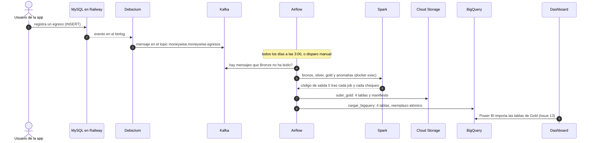
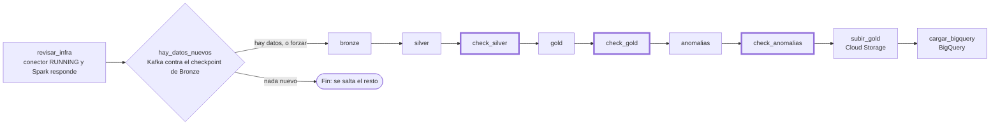
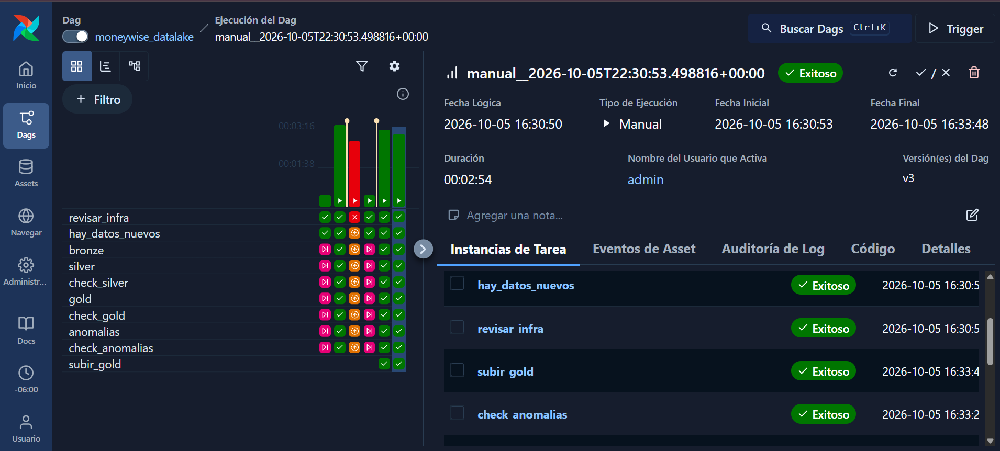
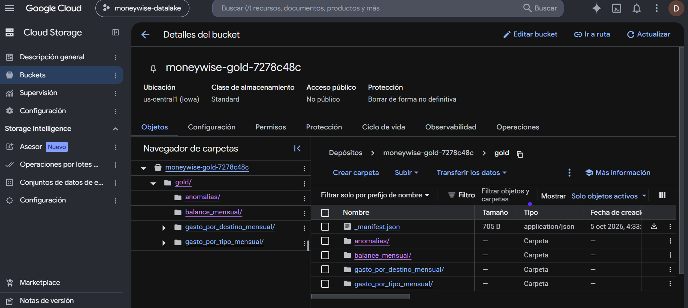
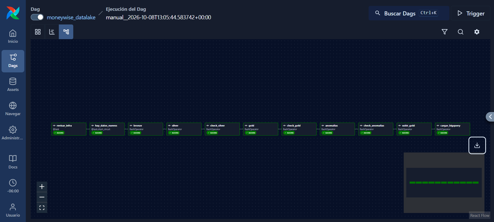
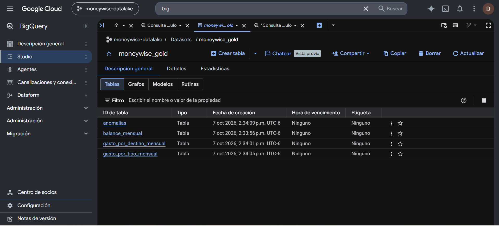
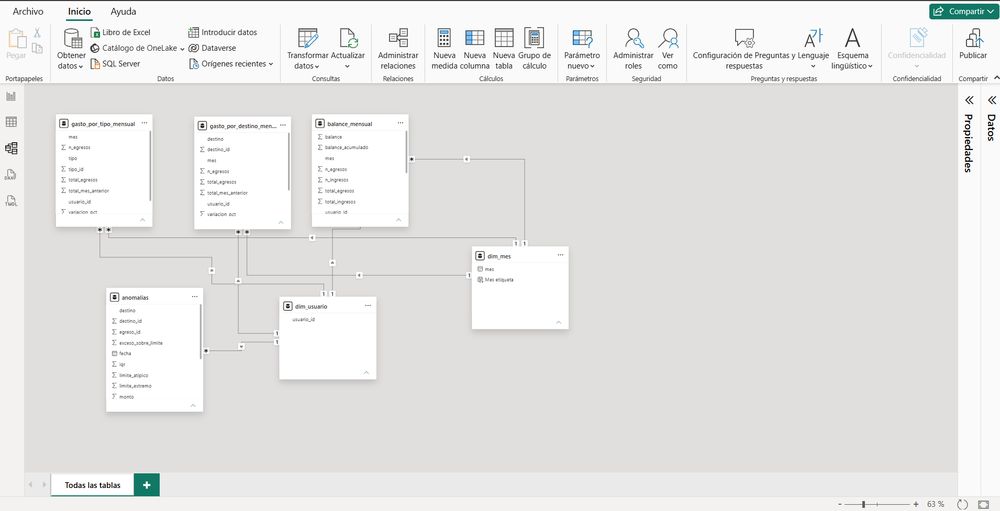

# Arquitectura de MoneyWise-DataLake

Este documento explica **cómo funciona** el data lake, **por qué** se tomó cada decisión y **qué problemas aparecieron** (y cómo se resolvieron). El diagrama general y las instrucciones para correrlo están en el [README](../README.md).

## Contenido

1. [Un cambio de punta a punta](#1-un-cambio-de-punta-a-punta)
2. [Las capas de datos](#2-las-capas-de-datos)
3. [El DAG de Airflow](#3-el-dag-de-airflow)
4. [Cloud Storage, BigQuery y el dashboard](#4-cloud-storage-bigquery-y-el-dashboard)
5. [Decisiones de diseño y por qué](#5-decisiones-de-diseño-y-por-qué)
6. [Seguridad](#6-seguridad)
7. [Operación del día a día](#7-operación-del-día-a-día)
8. [Problemas que aparecieron y cómo se resolvieron](#8-problemas-que-aparecieron-y-cómo-se-resolvieron)
9. [Limitaciones conocidas y siguientes pasos](#9-limitaciones-conocidas-y-siguientes-pasos)

---

## 1. Un cambio de punta a punta

Qué pasa desde que alguien registra un gasto hasta que el dato llega al bucket de Cloud Storage:



Lo importante: **la app nunca sabe que existe el data lake**. Debezium lee el registro binario (binlog) de MySQL, que la base escribe de todos modos, así que no hay que tocar la aplicación ni consultar sus tablas.

## 2. Las capas de datos

| Capa | Dónde vive | Qué contiene | Reglas |
|---|---|---|---|
| **Bronze** | `data/bronze/tabla=<t>/fecha=<d>/` | Cada mensaje de Kafka **tal cual llegó**: `tabla`, `fecha`, `topic`, `partition`, `offset`, `kafka_ts`, `key` y `value` (el JSON de Debezium, sin interpretar) | Nunca se transforma. Cada corrida procesa solo lo nuevo (`availableNow`) con un checkpoint en `data/checkpoints/bronze`, y termina |
| **Silver** | `data/silver/<tabla>/` | Una tabla limpia por cada tabla de la fuente | Se queda con el **último evento de cada fila** (ordenado por el offset de Kafka), descarta las filas cuyo último evento fue un DELETE, aplica tipos explícitos (`spark/common/schemas.py`) y conserva el borrado lógico (`eliminado_en`). Se reconstruye completo en cada corrida |
| **Gold** | `data/gold/<tabla>/` | `balance_mensual`, `gasto_por_destino_mensual`, `gasto_por_tipo_mensual` y `anomalias` | Mismas reglas que los `sp_dashboard_*` de la app: solo movimientos activos, cada movimiento cuenta una vez, el mes sale de `fecha_inicio`. Sin datos personales (solo `usuario_id`) |

**Las tablas de Gold, en una línea:**
- `balance_mensual`: por usuario y mes, ingresos, egresos, balance y balance acumulado.
- `gasto_por_destino_mensual`: por usuario, mes y **destino**, que es la categoría del gasto (Renta, Alimentación…).
- `gasto_por_tipo_mensual`: por usuario, mes y **tipo de egreso**, que es el método de pago (Efectivo, Tarjeta…).
- `anomalias`: gastos inusualmente altos, con sus límites y su severidad.

**Anomalías (IQR).** Para cada usuario y destino se calculan los cuartiles Q1 y Q3 de los montos, y el rango intercuartílico `IQR = Q3 - Q1`. Un gasto es **atípico** si supera `Q3 + 1.5 × IQR` y **extremo** si supera `Q3 + 3 × IQR`. Los grupos con menos de 8 movimientos, o con IQR = 0, no se evalúan. Solo se marcan montos altos y solo egresos activos.

## 3. El DAG de Airflow

El DAG `moneywise_datalake` corre todos los días a las **3:00 (hora de Chihuahua)**, nace en pausa, nunca tiene dos corridas a la vez (`max_active_runs=1`) y no repite días perdidos (`catchup=False`).



| Tarea | Qué hace |
|---|---|
| `revisar_infra` | Pregunta a Kafka Connect por el estado del conector (conector y tarea en `RUNNING`) y comprueba que Airflow pueda ejecutar comandos en `mw-spark` |
| `hay_datos_nuevos` | Compara el siguiente offset de cada topic en Kafka con el último lote **confirmado** del checkpoint de Bronze. Si coinciden, no hay nada nuevo y se salta el resto. El parámetro `forzar` corre todo igual |
| `bronze`, `silver`, `gold`, `anomalias` | Los mismos `spark-submit` que se corrían a mano, vía `docker exec mw-spark` |
| `check_silver`, `check_gold`, `check_anomalias` | **Compuertas de calidad.** Terminan con código 1 si algún chequeo falla, y entonces el DAG se detiene |
| `subir_gold` | Publica Gold en Cloud Storage. Si `GCS_BUCKET` está vacío queda `skipped` |
| `cargar_bigquery` | Carga las 4 tablas de Gold de Cloud Storage a BigQuery. Si `BQ_DATASET` está vacío, o `subir_gold` se omitió, queda `skipped` |

**Qué verifica cada compuerta:**
- `check_silver`: cada tabla tiene filas, sin ids repetidos, ninguna fila cuyo último evento fue un DELETE y sin montos nulos.
- `check_gold`: los totales de Gold cuadran con los activos de Silver, `balance = ingresos - egresos`, el balance acumulado coincide con la suma y no hay filas repetidas por llave.
- `check_anomalias`: reglas internas más un **recálculo independiente en Python puro**, sin Spark, que debe dar las mismas anomalías y severidades.

### Pruebas de calidad con pytest

Además de las compuertas del DAG hay una suite de pytest (`tests/`) que corre **fuera de Airflow**, en tu equipo o en el CI, sin Spark ni Docker: lee los Parquet con `pyarrow` y compara con `Decimal` exacto.

| Grupo | Qué comprueba |
|---|---|
| Contrato | Columnas y tipos exactos de cada tabla de Gold (el dashboard va a depender de ellos) |
| Campos clave | Sin nulos, sin llaves repetidas, `mes` siempre día 1, sin totales ni conteos negativos |
| Coherencia | `balance = ingresos - egresos`, el acumulado, que el gasto por destino y por tipo sume lo que el balance, y la variación contra el mes anterior |
| Recálculo | Gold completo y las anomalías recalculados desde Silver en Python puro (`tests/referencia.py`) y comparados fila por fila con lo que dejó Spark |
| Fuente | `pytest -m fuente`: filas por tabla y totales por usuario y mes contra Railway, con consultas `SELECT` y TLS |
| Almacén | `pytest -m bigquery`: cada tabla de BigQuery tiene el contrato de Gold y es idéntica, fila por fila, al Parquet del lago |
| Defectos inyectados | A un lago sano se le introduce un defecto a propósito (una columna renombrada, un total alterado, una fila de menos...) y el chequeo correspondiente **debe** detectarlo |

```
pip install -r requirements-dev.txt
pytest                      # sobre data/ (corre el pipeline antes)
pytest --datos=sintetico    # sobre un lago inventado, sin datos reales: lo que corre el CI
pytest -m fuente            # además, compara contra Railway (solo lectura)
```

Dos cosas a tener en cuenta. La comparación con Railway es contra la base **en vivo**: si la app escribió desde la última corrida del pipeline habrá diferencias que no son un error del lago. Y la ruta de datos se da con signo igual (`--datos-dir=RUTA`); con un espacio, pytest la confunde con un archivo a probar.

**Reintentos y alertas.** Cada tarea se reintenta 2 veces con 2 minutos de espera (`MW_REINTENTO_MINUTOS`), con un máximo de 30 minutos por intento. Cada reintento y cada falla se anota en `airflow/logs/alertas.log` y queda visible en la interfaz.

## 4. Cloud Storage, BigQuery y el dashboard

`subir_gold` (script `gcp/subir_gold.py`) deja esto en el bucket:

```
gs://<tu-bucket>/gold/
├── balance_mensual/data.parquet
├── gasto_por_destino_mensual/data.parquet
├── gasto_por_tipo_mensual/data.parquet
├── anomalias/data.parquet
└── _manifest.json          fecha de publicación y huella MD5 de cada tabla
```

- **Nombre fijo por tabla.** Spark nombra sus archivos con un código aleatorio distinto en cada corrida; subirlos así llenaría el bucket de versiones viejas. Con nombre fijo, cada corrida **sobrescribe** la anterior, y sobrescribir un objeto es atómico: quien lea nunca ve un archivo a medias.
- **Verificación.** Después de subir, compara tamaño y MD5 contra el archivo local. Si algo no coincide, falla.
- **El manifiesto va al final.** Si `_manifest.json` existe, las 4 tablas ya están arriba y verificadas.
- **Si una tabla no tiene exactamente un Parquet, no se sube nada.**
- `python gcp/subir_gold.py --dry-run` muestra el plan sin tocar la nube.

### Configurar Cloud Storage (una sola vez, opcional)

1. En la consola de Google Cloud, crea un **proyecto** con una cuenta de facturación vinculada.
2. Crea un **bucket** en `us-central1`, clase Standard, acceso uniforme y con la prevención de acceso público activada. El nombre es único en todo el mundo: agrégale un sufijo propio. Solo `us-central1`, `us-east1` y `us-west1` entran al free tier.
3. Crea una **service account** sin roles de proyecto, y dale el rol *Storage Object Admin* **solo sobre ese bucket**.
4. Crea una **llave JSON** de esa cuenta y guárdala como `gcp/credentials/service-account.json` (Git la ignora).
5. En `.env` pon `GCP_PROJECT_ID` y `GCS_BUCKET`, y crea una alerta de presupuesto de $1 USD.
6. Recrea el scheduler: `docker compose up -d airflow-scheduler`.

### Cargar Gold en BigQuery

`cargar_bigquery` (script `gcp/cargar_bigquery.py`) es la última tarea del DAG. Es el patrón habitual en GCP: el lago guarda los archivos y un **almacén** sirve las tablas curadas a las herramientas de BI, que consultan SQL en lugar de leer archivos.

- **Un trabajo de carga por tabla**, desde `gs://<bucket>/gold/<tabla>/data.parquet` hacia `<proyecto>.<dataset>.<tabla>`, con `WRITE_TRUNCATE`: la tabla se reemplaza completa en una sola actualización atómica. Cargar datos desde Cloud Storage a BigQuery no cuesta.
- **Tablas nativas, no externas.** Las tablas externas leen los archivos en cada consulta y cada una se cobra por bytes leídos, y BI Engine (la aceleración de BigQuery para dashboards) no las soporta.
- **Decimales forzados a `NUMERIC`.** Si un decimal de Parquet no cupiera, la carga falla en lugar de cambiar de tipo en silencio. El contrato completo (columnas y tipos) lo verifica `pytest -m bigquery`.
- **Verificación al cargar:** las columnas son las esperadas y la tabla tiene tantas filas como informó el trabajo. Si algo no coincide, falla y las tablas siguientes no se cargan.
- **Si falla `cargar_bigquery`**, `subir_gold` ya terminó: Cloud Storage tiene el Gold nuevo y BigQuery conserva el anterior. La alerta lo avisa.
- Las 4 tablas se reemplazan una tras otra, no en una sola transacción: durante unos segundos el almacén puede tener tablas de dos corridas distintas.

**Configurarlo (una sola vez, opcional):**

1. En BigQuery, crea un **dataset** (por ejemplo `moneywise_gold`; solo letras, números y guiones bajos) en la **misma región que el bucket**.
2. A la service account del scheduler dale *BigQuery Job User* en el proyecto y *BigQuery Data Editor* **solo sobre ese dataset**. Para leer el bucket ya tiene su rol.
3. En `.env` pon `BQ_DATASET` (y `BQ_LOCATION` si no es `us-central1`).
4. Recrea el scheduler: `docker compose up -d airflow-scheduler`.

### Dashboard en Power BI

El dashboard (`dashboard/moneywise-gold.pbix`) es el último eslabón: Power BI Desktop **importa** las 4 tablas de BigQuery y las muestra en 4 páginas (balance, gasto por categoría, variación mensual y anomalías). La guía completa, con el modelo, las medidas y las capturas, está en [dashboard/README.md](../dashboard/README.md); aquí, lo esencial:

- **Modo Importar.** Los datos se copian al archivo, así que el dashboard responde sin consultar BigQuery en cada clic y no consume cuota. El costo: se actualiza al pulsar **Actualizar**, no solo.
- **Dos dimensiones y siete relaciones.** `dim_usuario` y `dim_mes` (una fila por usuario y por mes) se relacionan con las tablas de hechos de uno a muchos y con filtro en una sola dirección. Así un selector de usuario o de mes filtra las cuatro tablas a la vez, y las tablas de hechos nunca se filtran entre sí.
- **Medidas DAX.** Los totales, el balance acumulado y la variación contra el mes anterior son medidas que Power BI recalcula con cada filtro. La variación se calcula sobre los totales y no se suma la columna `variacion_pct`, porque un porcentaje por fila no se puede sumar.
- **Se comprobó a mano contra BigQuery.** `pytest -m bigquery` garantiza que BigQuery es idéntico al lago, pero no ve a Power BI; por eso las cifras de cada página se contrastaron con consultas SQL (detalle en el README del dashboard).

## 5. Decisiones de diseño y por qué

| Decisión | Por qué |
|---|---|
| **CDC con Debezium** en lugar de consultar tablas periódicamente | Captura cada INSERT, UPDATE y DELETE (incluidos los borrados) sin tocar la app ni cargar la base |
| **Fuente real en Railway** y copia local solo para pruebas | Datos reales de la app; el MySQL local sirve para experimentar sin tocar producción |
| **Debezium 3.6** | La versión 2.4 con la que se empezó no tenía soporte para MySQL 9, así que se actualizó |
| **`decimal.handling.mode=string`** | Debezium codifica los decimales en binario por defecto; como texto no se pierde precisión y Silver los convierte a decimal |
| **Se excluyen `auth_tokens` y `usuarios.password_hash`** del CDC | Los secretos nunca entran a Kafka ni al lake |
| **Silver ordena por offset de Kafka**, no por hora | El offset es un orden total dentro de la partición; los relojes pueden estar desfasados |
| **Silver conserva el borrado lógico** y Gold lo filtra | Silver es fiel a la fuente; las reglas de negocio viven en Gold, igual que en la app |
| **Silver y Gold se reescriben completos** (overwrite) | Es idempotente: el mismo Bronze siempre da el mismo Silver y el mismo Gold |
| **Destino ≠ tipo de egreso** en Gold | El destino es la categoría; el tipo es el método de pago. Una primera versión los confundió y se corrigió |
| **IQR en lugar de z-score** | Los cuartiles casi no se mueven por el propio valor extremo y no suponen una distribución en campana; con pocos datos, un z-score de 3 es casi inalcanzable |
| **Airflow con `LocalExecutor` y `docker exec`** | Es lo más simple y reproduce exactamente los comandos manuales. El costo: el socket de Docker da control sobre Docker del equipo, así que solo el scheduler lo tiene |
| **Compuertas de calidad que fallan de verdad** | Un chequeo que solo imprime `FALLA` no detiene nada; así no se publica un Gold dudoso |
| **Nombres fijos y manifiesto al final en Cloud Storage** | Sin versiones acumuladas, sobrescritura atómica y una señal clara de que la publicación terminó |
| **Llave JSON de mínimo privilegio**, montada solo en el scheduler y fuera de la imagen | Si se filtra, el daño se limita a un bucket y a un dataset |
| **Tablas nativas de BigQuery cargadas por el DAG** (no tablas externas ni URLs firmadas) | Es el patrón de la industria: la BI consulta un almacén. Las tablas nativas se pueden acelerar con BI Engine, la carga es gratis y se actualizan solas con cada corrida |
| **Decimales forzados a `NUMERIC`** | Un decimal que no cupiera hace fallar la carga en vez de cambiar de tipo sin avisar |
| **Power BI en modo Importar**, no DirectQuery | Sobre unos cientos de filas, importar es instantáneo y no gasta consultas de BigQuery; DirectQuery solo valdría la pena con datos enormes o que cambian a cada minuto |
| **Dimensiones `dim_usuario` y `dim_mes`** | Un selector sobre una tabla de hechos solo filtra esa tabla; con una dimensión compartida filtra todas |
| **`Variación %` como medida** | La columna `variacion_pct` está en puntos porcentuales por fila y no se puede sumar; la medida da el cambio real en filas sueltas y en totales |

## 6. Seguridad

- **Secretos.** Viven en `.env` (ignorado por Git) o en `gcp/credentials/` (ignorado por Git). Los de Airflow los genera `scripts/generar_secretos.py` sin mostrarlos.
- **Puertos.** Todos los puertos publicados escuchan **solo en `127.0.0.1`**: Zookeeper, Kafka, MySQL local, Kafka Connect, Jupyter, la interfaz de Spark y la de Airflow. Postgres de Airflow no publica ningún puerto.
- **Usuario de Debezium.** Solo tiene los permisos que el CDC necesita (`SELECT`, `RELOAD`, `SHOW DATABASES`, `REPLICATION SLAVE`, `REPLICATION CLIENT`); no puede escribir.
- **Datos personales.** Gold solo lleva `usuario_id`; `anomalias` no guarda la descripción del gasto; `password_hash` nunca entra al lake.
- **Docker.** Solo el scheduler de Airflow monta el socket de Docker, y solo él ve la carpeta `gcp/` (en solo lectura).
- **BigQuery.** La service account solo recibe *BigQuery Job User* (para lanzar trabajos) y *BigQuery Data Editor* sobre un único dataset. La misma llave puede escribir en el bucket y en ese dataset; en un equipo real se usarían cuentas separadas por función o identidades sin llaves.

## 7. Operación del día a día

| Quiero… | Comando |
|---|---|
| Apagar todo sin perder datos | `docker compose down` (**nunca** `-v`) |
| Prender todo | `docker compose up -d` |
| Ver si el conector sigue sano | `curl localhost:8083/connectors/moneywise-mysql-source/status` |
| Correr el pipeline sin Airflow | Los 4 comandos `docker exec mw-spark ...` del README |
| Probar el pipeline desde Airflow | Interfaz en `http://localhost:8085` → **Trigger** (con `forzar` para correr aunque no haya datos nuevos) |
| Ver reintentos y fallas | `type airflow\logs\alertas.log` (Windows) o `cat airflow/logs/alertas.log` |
| Correr las pruebas de calidad | `pytest` (tras correr el pipeline); `pytest -m fuente` para cuadrar contra Railway |
| Ensayar la subida a la nube | `docker exec mw-airflow-scheduler python /opt/airflow/gcp/subir_gold.py --dry-run` |
| Ensayar la carga a BigQuery | `docker exec mw-airflow-scheduler python /opt/airflow/gcp/cargar_bigquery.py --dry-run` |
| Probar otros umbrales de anomalías | `docker exec -e ANOM_K_ATIPICO=1.0 mw-spark /usr/local/spark/bin/spark-submit /home/jovyan/work/anomalies/anomalias_job.py` (y vuelve a correrlo sin la variable) |
| Reconstruir Bronze, Silver y Gold desde cero | Vacía `data/bronze` y `data/checkpoints` y corre los jobs en orden |

Las variables `ANOM_*` se leen dentro del contenedor de Spark, así que se pasan con `docker exec -e`: ponerlas en `.env` no tiene efecto.

## 8. Problemas que aparecieron y cómo se resolvieron

| Problema | Causa | Solución |
|---|---|---|
| Kafka no arrancaba tras `docker compose down` (`InconsistentClusterIdException`) | Zookeeper no tenía volumen: perdía su estado y Kafka conservaba el identificador del clúster anterior | Se agregaron volúmenes a Zookeeper. No usar `down -v` |
| Fallos de red de Spark dentro de Docker | Docker Desktop no tiene salida IPv6 | `JAVA_TOOL_OPTIONS=-Djava.net.preferIPv4Stack=true` en el servicio `spark` |
| Debezium 2.4 no era compatible con la versión de MySQL de la fuente | La 2.4 no tenía soporte para MySQL 9 | Se actualizó a Debezium 3.6 |
| Railway no emitía el binlog que necesita el CDC | MySQL arrancaba con `--disable-log-bin` en su comando de inicio | Se quitó esa opción y se creó el usuario `debezium` con permisos mínimos |
| Gold mostraba "categorías" que eran métodos de pago | Se usó `tipos_egreso` como categoría, y es el método de pago | La categoría real es el **destino**; ahora hay dos tablas separadas |
| El puerto 8080 fue rechazado en Windows (`forbidden by its access permissions`) | Windows rechazó publicar ese puerto en esa máquina; no estaba en un rango reservado y no se investigó la causa exacta | La interfaz de Airflow se publica en el 8085 |
| `No such container: mw-spark` desde Airflow | Spark no estaba levantado | `docker compose up -d` antes de disparar el DAG |
| `curl` al conector da `404` o `Empty reply` justo después de arrancar | Kafka Connect tarda unos segundos en restaurar el conector | Esperar 30 segundos y repetir |

## 9. Limitaciones conocidas y siguientes pasos

- **Los datos de prueba son aleatorios.** Las anomalías detectadas son, sobre todo, ruido estadístico; el nivel "extremo" se validó con casos construidos a mano y con una inserción real de prueba, no con datos reales.
- **Retención.** Kafka conserva los mensajes unos 7 días por defecto y el binlog de Railway 30. Si Bronze no corre durante más que la retención de Kafka, los eventos no leídos se pierden del topic.
- **Alertas locales.** Los avisos quedan en un archivo y en la interfaz. El correo requiere un servidor SMTP y otro secreto, y no está implementado.
- **La llave JSON no expira.** Se trata como una contraseña: mínimo privilegio, solo en el scheduler, y se elimina desde la consola si se filtra.
- **Una tabla de Parquet vacía no se ha probado contra BigQuery real.** Si algún día `anomalias` quedara sin filas y BigQuery rechazara el archivo, `cargar_bigquery` fallaría y alertaría en lugar de dejar una tabla vacía.
- **Sin versionado en el bucket.** Cada corrida reemplaza la anterior; no se pueden recuperar tablas de días previos.
- **Jupyter** usa por defecto el token `moneywise`. Escucha solo en `127.0.0.1`, pero si compartes el equipo cámbialo con `JUPYTER_TOKEN`.
- **En el dashboard, destino y tipo no se filtran entre sí.** `gasto_por_destino_mensual` no tiene `tipo` y `gasto_por_tipo_mensual` no tiene `destino`, así que un filtro de destino no puede afectar al gráfico de tipo de pago, ni al revés. Mejora pendiente: una tabla de Gold `gasto_por_destino_tipo_mensual` con usuario, mes, destino y tipo.
- **El dashboard no se actualiza solo.** Modo Importar: el DAG renueva BigQuery cada día, pero el `.pbix` guarda su copia hasta que alguien pulse **Actualizar**. Refrescarlo en automático requeriría publicarlo en el servicio de Power BI.
- **Las transformaciones de Spark no tienen pruebas unitarias propias.** Se comprueban por sus resultados (recálculo completo en Python puro y compuertas del DAG), pero no hay pruebas que ejecuten el código de Spark sobre entradas pequeñas y conocidas.
- **Las pruebas de calidad no están dentro del DAG.** Las compuertas `check_*` sí detienen el pipeline; la suite de pytest es una segunda verificación, externa, que además cuadra contra la fuente y se corre a mano o en el CI.

## 10. Evidencia

Corrida del DAG `moneywise_datalake` con las 10 tareas que tenía entonces, en verde (después se agregó `cargar_bigquery`, la tarea 11). La columna roja del historial es la prueba de falla con el conector de Debezium apagado (ver la [sección 3](#3-el-dag-de-airflow)).



Bucket de Cloud Storage con la capa Gold publicada: el manifiesto y una carpeta por tabla.



Corrida del DAG con las 11 tareas, incluida `cargar_bigquery`, en verde.



Las 4 tablas de Gold en BigQuery, dentro del dataset `moneywise_gold`.



Modelo de Power BI: cuatro tablas de hechos y dos dimensiones, con sus siete relaciones.



Las cuatro páginas del dashboard, con su detalle en [dashboard/README.md](../dashboard/README.md): [Balance](images/dashboard-balance.png), [Gasto por categoría](images/dashboard-gasto-categoria.png), [Variación mensual](images/dashboard-variacion-mensual.png) y [Anomalías](images/dashboard-anomalias.png).
